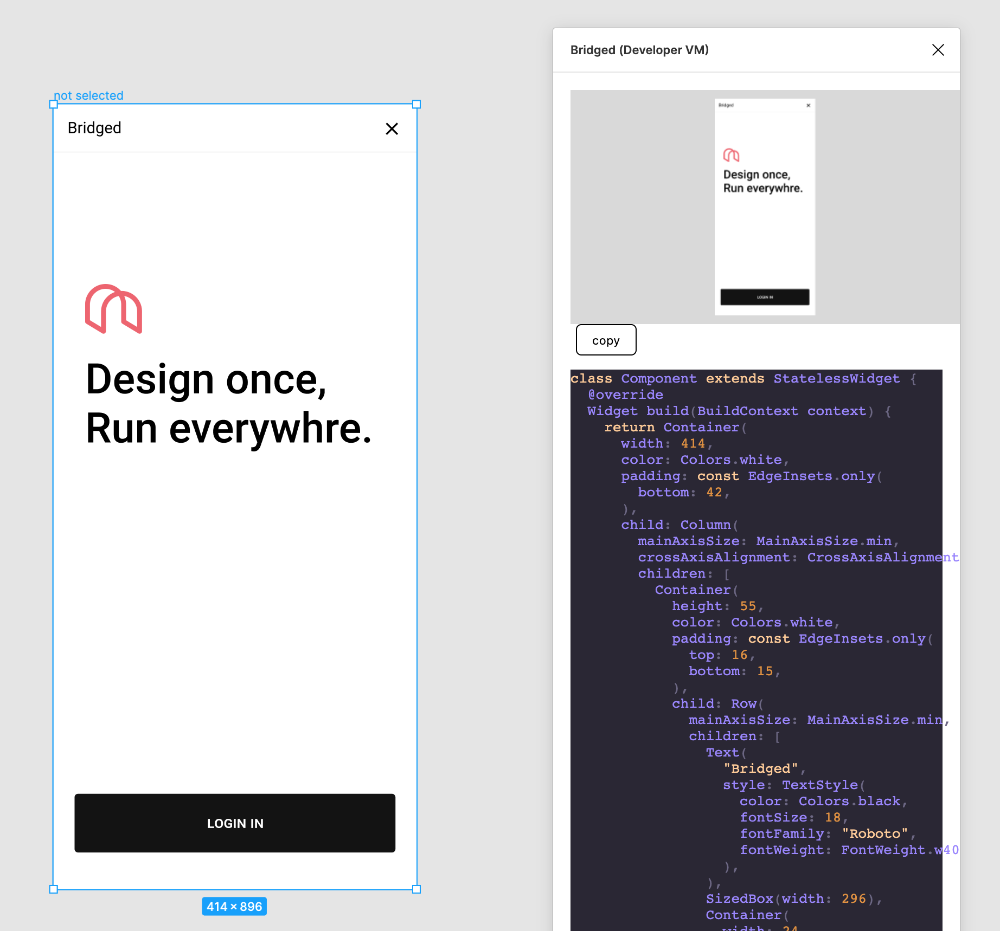

# bridged-figma-plugin

## Usage

install via figma plugin [link here](https://www.figma.com/community/plugin/890215203225987901/Bridged)

## Development guide

*This plugin is built with [Create Figma Plugin](https://github.com/yuanqing/create-figma-plugin).*

### Pre-requisites

- [Node.js](https://nodejs.org/)
- [Figma desktop app](https://figma.com/downloads/)

### Building the plugin

See [plugin README](/plugin/README.md)

## Flutter code builder

flutter widget builder is done by [figma/flutter](/flutter) and the core builder is powered by [bridged's dynamic](https://github.com/bridgedxyz/dynamic)
- [figma/flutter](/flutter)
- [bridgedxyz/flutter-js](https://github.com/bridgedxyz/flutter-js)
- [bridgedxyz/dynamic](https://github.com/bridgedxyz/dynamic)

- ✅ `Theme.of` Textstyle support
- ✅ `Colors.` Color support
- ✅ Slots support (not static content)
- ✅ Modularized builder functions - (not all-in-one widget tree)
- ✅ formatted dart code
- ✅ Best code quality (I Assure,) in this planet

### Debugging

Use `console.log` statements to inspect values in your code.

To open the developer console in the Figma desktop app, go to `Plugins` → `Development` → `Open Console`.

### Docs

- [Create Figma Plugin docs](https://github.com/yuanqing/create-figma-plugin#docs)
- [Figma plugin API docs](https://figma.com/plugin-docs/api/)

### LEGAL
the initial commit of this project was based on [FigmaToCode](https://github.com/bernaferrari/FigmaToCode) for use of flutter code generation, which was (is) under MIT License. By this acknowledgement and referencing the original MIT Licensed project, Bridged have done all legal obligation operations.

re-use of this software and it's license is overrided by [contributing-and-license](https://github.com/bridgedxyz/contributing-and-license)
